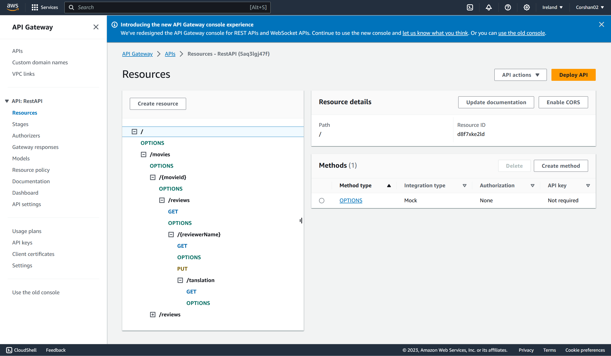
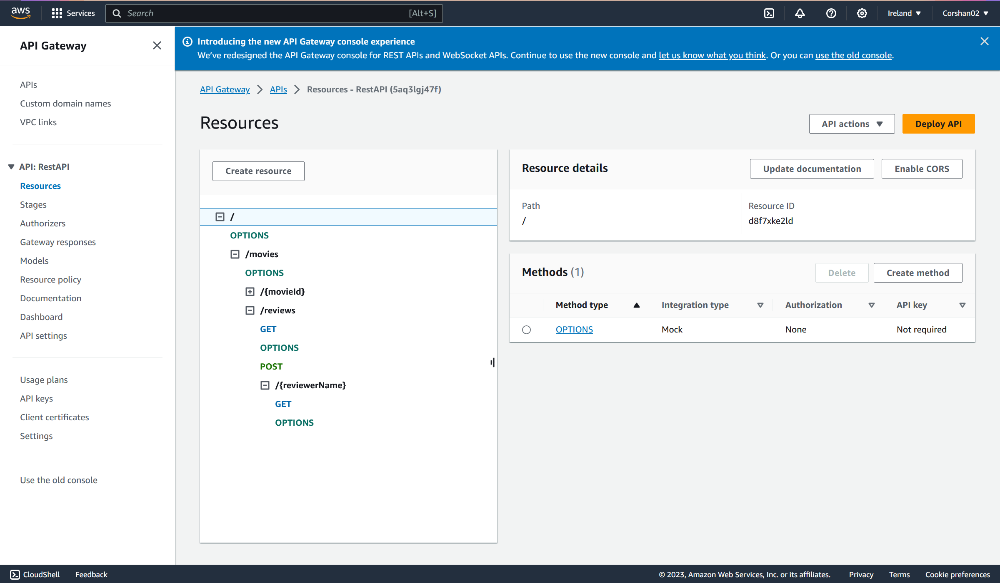
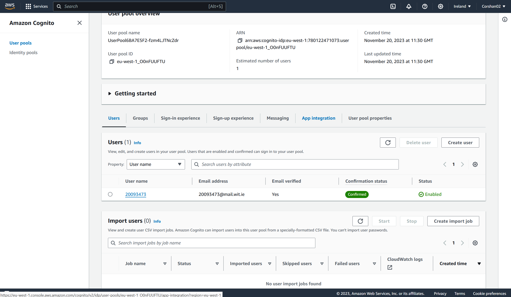
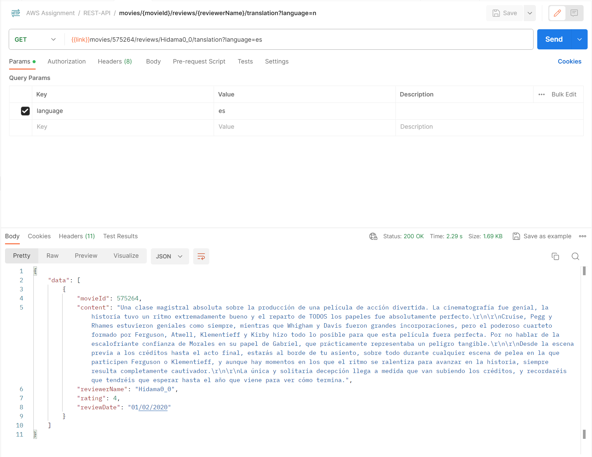

## ServerlessREST Sddignment - Distributed Systems.

__Name:__ Corey Shanahan

This repository contains the implementation of a serverless REST API for the AWS platform. A CDK stack creates the infrastructure. The domain context of the API is movie reviews.

### API endpoints.

+ GET ``/movies/reviews`` - get all reviews
+ POST ``/movies/reviews`` - add a movie review.
+ GET ``/movies/reviews/{reviewerName}`` - get all reviews by a reviewers name
+ GET ``/movies/{movieId}/reviews`` - get all reviews for a movie
+ GET ``/movies/{movieId}/reviews/{reviewerName}`` - get reviews from a movie written by a reviewer's name
+ PUT ``/movies/{movieId}/reviews/{reviewerName}`` - update a review by movieId and reviewers name
+ GET ``/movies/{movieId}/reviews/{reviewerName}/translation?language=n`` - get a review by movie ID and reviewers name and have it translated into another langauge
+ GET ``movies/{movieId}/reviews/{year}`` - get a reviews by movie id and the year it was written 
+ GET ``movies/{movieId}/reviews?minRating=n`` - get all reviews from a movie that is rated above the min rating

### Authentication

### Independent learning (If relevant).

As part of indepentant learning, I add a endpoint that would translate reviews into any language of choice. This uses AWS Translation service. 

You can find this in `lambdas\rest\getReviewTranslation.ts`

+ GET ``/movies/{movieId}/reviews/{reviewerName}/translation?language=n`` - get a review by movie ID and reviewers name and have it translated into another langauge

